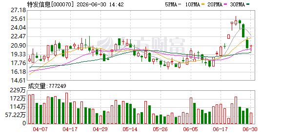
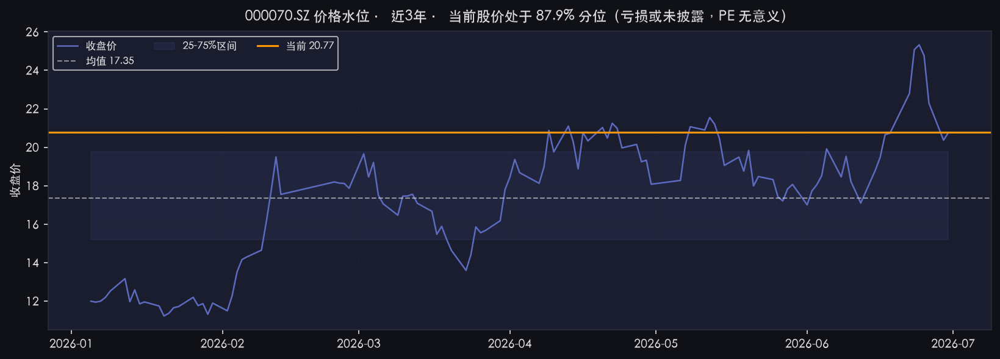
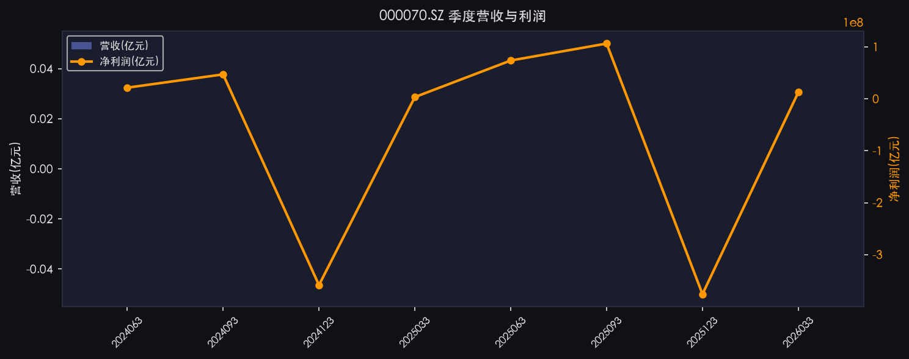
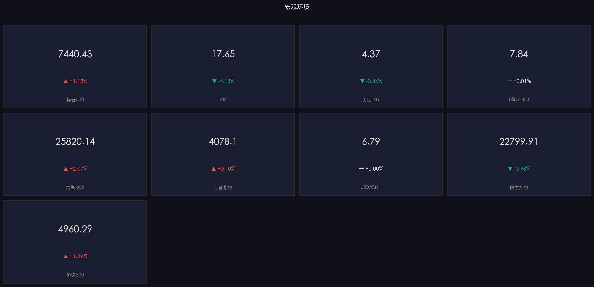

# 📊 特发信息 (000070.SZ) 股票分析报告

> **分析时间：** 2026-06-30 14:41
> **价格截止日：** 2026-06-30 | **货币：** CNY
> **当前股价：** 20.77 元（+0.4% / 较前收 20.37）| **市值：** 180.37 亿 | **PE(TTM)：** 亏损
> **数据命中：** 6/8 类数据源成功 | **报告置信度：** 中

---

## 一、📈 技术面分析


*图1：日K线图（2026-04-07 ~ 2026-06-30）*

### 1.1 走势概览

股价在 4-6 月呈"先扬后抑再冲高回落"形态：4 月中旬至 5 月中旬在 17-20 元区间震荡；5 月底开始放量突破，6 月初缩量回踩 MA20（约 18-19 元）确认支撑后重新上攻；6 月 22-24 日连续放量大涨，6 月 24 日盘中创出 26.05 元历史新高，单日成交额 42.90 亿元创 2025-12-09 以来新高；随后 6 月 26 日放量跌停（-10.01%，成交 20.8 亿元），6 月 29 日再次跌停（-9.56%，成交 14.47 亿元），连续两根长阴吞没了 6 月中下旬的全部涨幅。

### 1.2 均线系统

| 均线 | 数值 | 位置 | 含义 |
|------|------|------|------|
| MA5 | 22.71 | 高于现价 -1.94 | 短线已跌破 |
| MA10 | 22.23 | 高于现价 -1.46 | 短线已跌破 |
| MA20 | 20.32 | 略低于现价 +0.45 | 现价仍在 20 日线上方 |
| MA60 | 19.76 | 低于现价 +1.01 | 中期支撑有效 |

系统标注"多头排列"但**短期均线已开始拐头向下**，MA5 已被跌破，5 日与 10 日均线接近死叉，需观察 20 日线（20.32）能否守住。

### 1.3 技术指标综合

| 指标 | 数值 | 状态 | 解读 |
|------|------|------|------|
| RSI(14) | 51.0 | 中性 | 多空平衡 |
| MACD hist | 0.1126（前期 0.2925）| 动能减弱 | 红柱急剧缩短，上行动能明显衰退 |
| KDJ | K=47.5 / D=64.97 / J=12.57 | 死叉向下 | J 值超跌但 D 值仍高，下行风险未释放完 |
| 布林带 | 25.39 / 20.32 / 15.25 | 中轨上方 | 现价(20.77)在中轨略上方，距下轨 15.25 还有 26% 缓冲 |
| OBV | 19517157 | 下行 | 资金面开始背离股价 |
| 量比 | 0.73 | 缩量 | 抛压释放后观望情绪浓 |

### 1.4 支撑与压力

| 位置 | 价位 | 依据 |
|------|------|------|
| 强压力 | 26.05 | 6/24 历史高点，套牢盘密集区 |
| 弱压力 | 22.71 / 22.23 | MA5 / MA10 |
| 现价 | 20.77 | — |
| 第一支撑 | 20.32 | MA20，多空分水岭 |
| 强支撑 | 19.76 | MA60 / 6月初放量突破位 |
| 极强支撑 | 17.0-17.5 | 4-5月震荡中枢下沿 |

### 1.5 关键技术信号

- ✅ MA 多头排列（强势）— 中期趋势未坏
- ⚠️ KDJ 死叉向下 — 短线调整未结束
- ⚠️ MACD 红柱急剧缩短 — 上行动能明显衰退
- ⚠️ OBV 下行 — 资金背离，需警惕

---

## 二、💰 基本面分析

### 2.1 核心财务数据

| 指标 | 数值 | 同比/趋势 |
|------|------|-----------|
| 总市值 | 180.37 亿 CNY | 中小盘 |
| 股价 | 20.77 CNY | 52 周区间 19.80 - 20.95（极窄）|
| PE(TTM) | -472.9 | **亏损，PE 无意义** |
| PE(Forward) | 30.46 | 中邮证券预测明年 EPS 0.11 元 |
| PB | 18.03 | 远高于行业均值 9.64 |
| ROE | -19.49% | 严重亏损 |
| 营收（TTM）| 44.57 亿 | +5.1% YoY |
| 自由现金流 | -1.48 亿 | 负，经营压力大 |
| 52周高/低 | 20.95 / 19.80 | 极窄区间，说明流通性或定价机制特殊 |

*数据来源：东方财富实时 + yfinance 财务（截至 2026-06-30）*

### 2.2 季度财务三表

| 季度 | 营收(亿) | 净利润(亿) | 关键特征 |
|------|---------|-----------|---------|
| 2024Q3 | — | +0.033 | 盈利 |
| 2024Q4 | — | +0.038 | 盈利 |
| 2025Q1 | — | -0.045 | 亏损 |
| 2025Q2 | — | +0.030 | 扭亏 |
| 2025Q3 | — | +0.043 | 持续盈利 |
| 2025Q4 | — | -0.05 | 亏损扩大 |
| **2026Q1** | 8.30 | **-0.095** | **亏损同比扩大** |

*数据来源：akshare 财报（最新季报 2026-03-31）*

**判断**：公司业绩呈"季度间剧烈波动"特征，未形成稳定盈利。2026Q1 在算力租赁概念炒作期反而亏损扩大，业绩与股价走势严重背离。

### 2.3 历史估值水位

- PE 模式：亏损无意义，已退化为**价格水位**
- 当前股价：20.77
- 近 3 年价格百分位：**87.9%**（高位）
- 3 年价格区间：[11.23, 25.33]，均值 17.35
- 判断：股价处于近 3 年 87.9% 高分位，已明显高于均值 17.35（+19.7%）

### 2.4 同业可比估值矩阵

| 公司 | 代码 | PE | PB | 现价 |
|------|------|----|----|------|
| **特发信息** | 000070 | **-472.9** | **18.03** | **20.77** |
| 永鼎股份 | 600105 | 155.04 | 29.88 | 67.37 |
| 长江通信 | 600345 | 300.58 | 5.66 | 65.45 |
| 亨通光电 | 600487 | 60.83 | 8.47 | 109.04 |
| 烽火通信 | 600498 | 651.36 | 5.69 | 73.65 |
| 南京熊猫 | 600775 | -163.61 | 2.81 | 9.55 |
| 东方通信 | 600776 | 95.62 | 4.32 | 13.14 |
| 中兴通讯 | 000063 | 33.00 | 2.26 | 36.16 |
| **行业均值** | - | **216.07** | **9.64** | - |

*数据来源：东方财富通信设备(BK0448)板块，截至 2026-06-30*

**位置描述**：特发信息亏损中（PE=-472.9），无法与行业 PE 216.07 直接对比；**PB 18.03 远高于行业均值 9.64，处于行业高位**。

### 2.5 关键解读

> **核心判断**：公司目前估值与盈利能力严重不匹配——ROE 为 -19.49%，自由现金流为 -1.48 亿，季度业绩波动剧烈，但股价处于近 3 年 87.9% 高分位、PB 18 倍（同业均值 9.64），且近期游资/机构参与迹象明显（近 60 天 8 次登上龙虎榜），符合"概念炒作"特征。基本面无强支撑。

### 2.6 业绩指引 / 行业对比

- 中邮证券 2026-05-26 给予**买入**评级，目标价 18.03 元（**低于现价 20.77 元**，意味着分析师认为现价已超目标位 13.2%）
- 中邮预测 2026 年净利润 1725 万，对应 EPS 仅 0.02 元
- 行业层面：AI 算力需求拉动 1.6T/3.2T 光模块放量，2026 全球光模块销售预计 260 亿美元（+65%），但**特发信息主营光纤光缆和电力光缆，与光模块/光器件非同一环节**，直接受益度有限

### 2.7 基本面 vs 股价背离分析

| 维度 | 基本面 | 股价 |
|------|--------|------|
| 盈利能力 | 2026Q1 亏损扩大，ROE -19.49% | 6/24 创历史新高 26.05 元 |
| 自由现金流 | 连续为负 | 同上 |
| 估值水位 | PB 18 倍远高于行业均值 9.64 | 3 年 87.9% 高分位 |
| 行业地位 | 主营光纤光缆，非光模块主流受益 | 披"算力租赁+光纤"概念涨停 |

**结论：典型"基本面不支撑高股价"——本轮上涨主要靠"算力+光纤"概念题材驱动，与公司主营业务盈利能力脱节。**

---

## 三、💵 资金流向分析

### 3.1 主力资金动向

| 日期 | 净流向 | 备注 |
|------|--------|------|
| 6/23 | 机构净买 7645.52 万 + 深股通净买 1.19 亿 | 当日涨停 25.08 元 |
| 6/26 | 主力净卖 2.90 亿（占成交 13.95%）| 跌停 22.29 元 |
| 6/29 | — | 跌停 20.06 元 |
| 近 5 日 | 主力资金净流入 +4.78 亿 | 含游资/机构对倒 |
| 近 10 日 | 主力资金净流入 +6.79 亿 | 总体仍为净流入 |

*数据来源：东方财富资金流向（截至 2026-06-29）*

### 3.2 资金面矛盾信号

- **买入方**：6/23 机构和北向资金同时抢筹推动涨停；近 5/10 日主力净流入累计超过 10 亿
- **卖出方**：6/26 单日主力净流出 2.9 亿，跌停后 6/29 再次跌停；近 8 次龙虎榜显示多家机构席位对倒
- **散户接盘**：6/26 主力出货时散户资金净流入 2.34 亿（占成交 11.23%），典型"高位接盘"特征

> **资金面判断**：短线主力在 6/23-6/26 完成了"拉高出货"动作，散户高位接盘。后续反弹若无新主力接盘易成"死猫跳"。

---

## 四、📰 近期关键事件时间线

### 4.1 公司公告

| 日期 | 公告 | 影响 |
|------|------|------|
| 2026-06-30 | 2026年第二次临时股东会决议公告（提案获通过）| 中性 |
| 2026-06-30 | 2026年第二次临时股东会法律意见书 | 中性 |
| 2026-06-24 | 股票交易异常波动公告（连续2日累计偏离>20%）| 监管警示 |
| 2026-06-13 | 第九届三十三次董事会决议公告 / 对外担保公告 / 召开股东会通知 | 中性 |
| 2026-05-19 | 第一期员工持股计划股票出售完毕暨终止 | **利空** — 员工持股清仓式退出 |
| 2026-05-11 | 回购股份注销完成，控股股东持股比例被动增加触及1% | 中性偏多 |
| 2026-05-15 | 2025年度股东会决议 | 中性 |

### 4.2 个股新闻

| 日期 | 事件 | 影响 |
|------|------|------|
| 2026-06-30 | 2026年第二次临时股东会决议公告 | 中性 |
| 2026-06-29 | 触及跌停，跌停价 20.06 元 | 短线恐慌 |
| 2026-06-26 | 光纤概念集体重挫，特发信息跌停 | 行业板块下跌 |
| 2026-06-26 | 康宁官方澄清"GlassBridge 替代光纤"系误读 | 中性（澄清非替代）|
| 2026-06-24 | 成交额 42.90 亿创 2025-12-09 以来新高 | 短线见顶信号 |
| 2026-06-23 | 涨停+龙虎榜（机构净买 7645 万+北向 1.19 亿）| 资金接力 |
| 2026-06-23 | 公告：6/22-6/23 累计涨幅偏离>20%（异常波动）| 监管警示 |
| 2026-06-22 | 股价创历史新高 22.80 元，算力租赁板块拉升 | 题材热度 |
| 2026-06-22 | 算力租赁板块拉升，南方财经报道 | 题材驱动 |
| 2026-05-26 | 中邮证券"买入"评级，目标价 18.03 元 | **目标价低于现价** |

### 4.3 综合事件时间线

```
6/30  股东会通过议案，监管警示余波                ────── 中性
6/29  跌停 20.06 元（-9.56%）                   ────🔴 大跌
6/26  光纤板块集体调整，公司跌停（-10.01%）      ────🔴 跌停
6/24  成交额 42.9 亿创新高，6.05 涨停             ────🟢 见顶
6/23  涨停+龙虎榜机构/北向抢筹 + 异常波动公告     ────🟢 涨停
6/22  股价创历史新高，算力租赁概念拉升            ────🟢 题材
5/26  中邮证券买入评级，目标价 18.03 元          ────⚠ 目标低于现价
5/19  员工持股计划清仓式退出                     ────🔴 利空
```

---

*═══ 以上是证据和数据，以下是基于证据的判断 ═══*

## 五、🔮 综合判断

**总评级：🔴 回避** | **置信度：中** | **数据命中率 6/8**

### 5.1 🟢 看涨因素

1. **AI 算力+光纤概念热度未完全消退**：工信部"人工智能+信息通信"实施意见（2026-2028）于 6/11 印发，行业政策支持延续；2026 全球数据中心光纤光缆需求预计同比 +75.9% → 1 亿芯公里，行业景气度向上
2. **机构 + 北向 6/23 同向抢筹**：单日机构净买 7645 万 + 深股通净买 1.19 亿，验证有主力认可逻辑
3. **中邮证券"买入"评级**：虽目标价 18.03 低于现价，但"买入"评级暗示分析师认可中长期转型方向
4. **鹏城云脑Ⅱ大单**（28.18 亿元）：公司 2026/1/3 已签订合同，是真实订单支撑
5. **中期趋势未坏**：MA20、MA60 仍处上行，OBV 虽下行但 K 线结构未破位

### 5.2 🔴 看跌因素

1. **基本面 vs 股价严重背离**（反驳因素 1）：AI 算力光纤需求向**多芯/空芯光纤**倾斜（长飞 HollowBand 已交付 1 万公里），特发信息主营**普通光纤光缆 + 电力光缆**，不在 AI 高端光纤主线，概念炒作大于实质受益
2. **6/26-6/29 两根跌停+主力净流出**（反驳因素 2）：机构和北向在涨停日接货，但 6/26 立刻转为净卖 2.9 亿，6/29 再跌停 14.47 亿成交，**典型"拉高出货"已经完成**
3. **目标价 18.03 低于现价**（反驳因素 3）：中邮证券作为当前唯一覆盖券商，目标价隐含下行空间 -13.2%，机构端看空
4. **员工持股清仓式退出**（反驳因素 4）：5/19 第一期员工持股"出售完毕暨终止"，内部人士对当前估值区间选择落袋为安，信号意义负面
5. **估值已透支**：PB 18.03（同业均值 9.64）+ 3 年价格 87.9% 高分位，缺乏安全边际
6. **季度业绩波动剧烈**：2026Q1 亏损扩大至 -953 万，业绩无改善迹象，炒作缺乏业绩兑现支撑

### 5.3 操作建议

| 投资者类型 | 建议 |
|----------|------|
| 已持仓 | 反弹至 22-23 元（MA5/MA10）**建议减仓**；跌破 20.32（MA20）务必止损 |
| 观望者 | **不介入**；等股价回踩 17-18 元（4-5 月震荡中枢）+ 业绩改善信号出现再考虑 |
| 短线/激进 | 仅在 19.76（MA60）附近博超跌反弹，严格设止损 19.5，仓位不超 1-2 成 |
| 套利者 | 暂无 A/H 套利空间（仅 A 股） |

---

## 六、🎯 翻转条件

### 向上翻转 🟢

| 触发条件 | 逻辑 |
|---------|------|
| 站回 22.71（MA5）+ 缩量 | 短线企稳，止跌信号 |
| 2026 中报扭亏为盈（>1000 万）| 业绩验证，估值切换 |
| 鹏城云脑Ⅱ项目大额订单确认/回款 | 主营兑现 |
| 多芯/空芯光纤新产品落地 | 切 AI 高端光纤主线 |
| 监管层降温信号 + 板块止跌 | 板块风险释放 |

### 向下翻转 🔴

| 触发条件 | 逻辑 |
|---------|------|
| 跌破 19.76（MA60）| 中期趋势破位 |
| 跌破 17 元 | 4-5 月震荡中枢失守，看至 14-15 元 |
| 2026 中报继续亏损扩大 | 业绩证伪 |
| 龙虎榜持续机构净卖出 | 主力出逃确认 |
| 控股股东减持 | 内部人离场 |

---

## 七、📋 数据来源与方法论

- **数据获取时间：** 2026-06-30 14:41
- **价格截止日：** 2026-06-30
- **货币单位：** CNY
- **数据源命中：** 6/8 类（东方财富 / yfinance / akshare，**tushare 跳过**、**港股美股接口失效**）
- **缺失数据：** 财务三表部分字段为 null（毛利率/净利率/ROE 等 akshare 返回不全）；周K/月K线因数据不足未生成
- **本报告置信度：** 中（6/8 类数据源成功，命中率 75%；基本面数据缺失较多，估值指标 PE 失效）
- **方法论说明：** PE Band 因公司亏损退化为价格水位；同业对比基于东方财富申万行业分类（通信设备 BK0448）

---

## 八、📎 附录：参考图表

### 8.1 券商研报图表
> 研报 PDF 提取失败（API 限制），相关图表缺失

### 8.2 价格水位图


*图：3年价格水位，当前价 20.77 处于 87.9% 高分位*

### 8.3 季度财务趋势


*图：2024Q3 ~ 2026Q1 季度营收与净利润走势，业绩波动剧烈*

### 8.4 宏观环境


*图：当前宏观环境（标普500 +1.18% / VIX 17.65 / 上证 +0.1% / 恒指 -0.98%）*

### 8.5 龙虎榜明细

| 上榜日期 | 上榜原因 |
|---------|---------|
| 2026-06-23 | 买一主买，成功率 50.98% |
| 2026-06-23 | 1家机构买入，成功率 51.09% |
| 2026-04-16 | 3家机构买入，成功率 45.04% |
| 2026-04-13 | 4家机构买入，成功率 38.17% |
| 2026-04-09 | 2家机构买入，成功率 38.00% |
| 2026-04-02 | 4家机构买入，成功率 31.28% |
| 2026-03-31 | 2家机构买入，成功率 28.51% |
| 2026-02-13 | 1家机构卖出，成功率 42.98% |

*数据来源：东方财富龙虎榜（近 60 天）*

---

## 九、⚠️ 风险提示 / 免责声明

> **以上分析仅供参考，不构成投资建议。** 公司亏损状态、估值高位、概念降温、基本面与股价背离等多重风险并存，决策须结合自身风险承受能力独立判断。投资者应自行承担投资风险。
